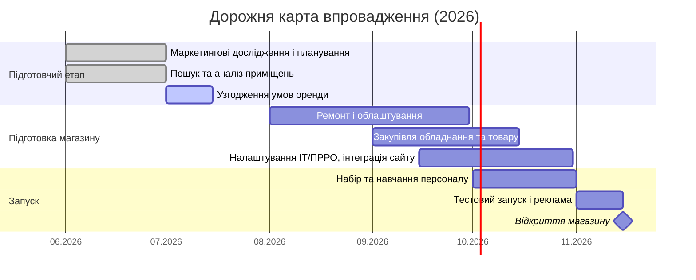

# План відкриття фізичного магазину footballshop.com.ua

> Документ описує операційний план, юридично-фінансові схеми залучення інвестора,
> фінансову модель, дорожню карту та ризики відкриття офлайн-точки.
> Усі суми — прогнозні й потребують уточнення під конкретну локацію та орендні ставки.
> Податкові ставки слід підтвердити з податковим консультантом перед підписанням
> угод (норми воєнного часу змінюються).

## 1. Операційний план

> **КРИТИЧНО про вибір ПЗ.** Станом на **6 січня 2026 року** Держспецзв'язку
> офіційно **заборонила** використання російського ПЗ родини **1С** та **BAS** в
> Україні; заборона стосується не лише закупівель, а й самого факту використання,
> зі штрафами до **2% річного обороту**. Bitrix (1С-Бітрікс, Bitrix24) та МойСклад
> також є продуктами російського походження — **використовувати їх не можна.**
> Нижче — лише дозволені альтернативи.

- **Облік запасів та ERP/CRM (дозволені рішення).** Українські та нейтральні
  системи: **Dilovod**, **MASTER:Бухгалтерія**, **IT-Enterprise**, **SmartFusion**,
  а також open-source/міжнародні **Odoo**, **ERPNext**. Для роздробу та
  e-commerce — українські CRM/обліки **KeyCRM**, **SalesDrive**, **Perfectum**.
  Потрібна синхронізація залишків між складом і магазином через API, звіти про
  залишки, точки дозамовлення (reorder point), штрихкодування та мобільні сканери.
- **Логістика/комплектація.** Доставка по Україні через Нову пошту, Укрпошту,
  Justin (найпоширеніша — Нова пошта). Можливий самовивіз із нового магазину. У
  собівартість закласти тарифи доставки та пакувальні матеріали.
- **POS-інтеграція та омніканальність.** Єдина база товарів і залишків для онлайну
  й офлайну, спільний каталог, єдиний акаунт клієнта (історія замовлень, бонуси).
  Програмні РРО — **Checkbox** (український ПРРО), **Вчасно.Каса**, або POS-системи
  для роздробу **Poster**, **iKassa**. Фіскалізація обов'язкова (формування
  Z-звіту). ПРРО для більшості розрахункових операцій є обов'язковими в Україні з
  2022 року.
- **CMS та платіжна інфраструктура.** Допустимі платформи: **WooCommerce**,
  **Shopify**, **OpenCart**, **Magento**, або кастомне рішення (поточний сайт —
  на Next.js). Підключення українських платіжних шлюзів (LiqPay, Fondy, Portmone,
  WayForPay) та інтеграція з Новою поштою. 1С-Бітрікс як CMS — **виключити**.
- **Поточні витрати.** Утримання складу (оренда, зберігання), зарплати
  комплектувальників/операторів, комунальні, інтернет. Оптимізація через крос-промо
  онлайн/офлайн і єдину бонусну програму.

## 2. Юридичні та фінансові схеми з інвестором

Мета — залучити інвестора у фізичну точку **без передачі частки в онлайн-бізнесі**.
Можливі конструкції:

- **Окрема юридична особа (нове ТОВ / SPV).** Фізична точка оформлюється на окреме
  ТОВ; інвестор входить капіталом або позикою саме в цю компанію. Онлайн-магазин,
  права на сайт і торгову марку залишаються в іншій (материнській) структурі та
  100% під контролем власника.
- **Позика / конвертована позика (convertible loan).** Інвестор надає кредит під
  фіксований відсоток; за домовленістю частина боргу може конвертуватися в частку
  **нового ТОВ**. Перевага — контроль (власник може не конвертувати) і фіксований
  дохід інвестора; мінус — зобов'язання з виплат і ризик неповернення.
- **Договір про спільну діяльність (просте товариство, гл. 77 ЦКУ).** Інвестор
  фінансує лише офлайн-проєкт і отримує частину чистого прибутку точки без зміни
  структури власності ТОВ. Плюс — гнучкість; мінус — слабший захист інвестицій,
  відсутність корпоративних прав, податкові нюанси.
- **Франчайзинг / ліцензія на бренд (договір комерційної концесії, гл. 76 ЦКУ).**
  Інвестор відкриває точку під брендом і платить роялті/відсоток, не отримуючи прав
  на онлайн-бізнес. Плюс — чисто контрактна структура; мінус — потреба формалізувати
  стандарти, навчання й аудит.
- **Управлінський контракт (management contract).** Власник зберігає управління,
  інвестор фінансує та отримує винагороду/представництво у фінансовому контролі
  нового ТОВ без частки в материнській компанії; із KPI та умовами виходу.

**Орієнтовні пункти term-sheet:**
- *Предмет:* інвестор надає фінансування у розмірі X грн виключно на запуск точки
  (оренда, ремонт, обладнання, товар).
- *Транші:* напр., 20% одразу, решта — за досягненням віх (підписання оренди,
  дозволи тощо).
- *Розподіл доходу:* фіксований % від чистого прибутку (позикова схема) або частка
  виручки (revenue-share).
- *Конвертація:* право конвертувати позику в частку нового ТОВ через 2–3 роки за
  узгодженою оцінкою.
- *Гарантії:* застава (обладнання, орендні права), фінзвітність, право аудиту.
- *Вихід:* умови розірвання та викупу частки.

**Податкові та регуляторні аспекти (станом на 2026):**
- **ПРРО/РРО:** магазин зобов'язаний застосовувати програмний РРО (напр.,
  Checkbox) при розрахунках із покупцями.
- **Оподаткування дивідендів інвестору-фізособі:** **ПДФО 5%** (якщо ТОВ на
  загальній системі) або **9%** (якщо емітент на єдиному податку), плюс **військовий
  збір 5%**. Військовий збір з дивідендів утримують лише тоді, коли вони
  оподатковуються ПДФО.
- **Процентний дохід інвестора за позикою:** ПДФО 18% + військовий збір 5%.
- **Розмежування бізнесів:** онлайн і офлайн доцільно вести через окремі
  ФОП/ТОВ, щоб прибуток і ризики не змішувалися.
- **Законодавство:** Закон «Про товариства з обмеженою відповідальністю» дозволяє
  конвертацію боргу в капітал ТОВ. Якщо інвестор — нерезидент, врахувати валютне
  регулювання НБУ.

## 3. Фінансова модель

Орієнтовні оцінки для магазину ~40–50 м² **у цінах 2026 року** (попередні оцінки
2020 р. збільшено у ~3–4 рази: інфляція, девальвація, зростання оренди й зарплат).

| Стаття | Мін, грн | Макс, грн |
|:--|--:|--:|
| **CapEx** | | |
| Ремонт/облаштування (зал, стелажі, фасад) | 500 000 | 1 000 000 |
| Початковий товарний запас | 1 000 000 | 1 400 000 |
| Техніка / каса | 150 000 | 200 000 |
| Дизайн-проєкт | 80 000 | 140 000 |
| Юридичне оформлення (ТОВ, інвестдоговір, оренда) | 100 000 | 190 000 |
| ІТ: ERP/CRM, ПРРО, інтеграція з сайтом | 200 000 | 320 000 |
| Завдаток за оренду (2 міс.) | 140 000 | 220 000 |
| Маркетинг запуску | 100 000 | 180 000 |
| **Разом CapEx** | **~2 270 000** | **~3 650 000** |
| *+ Рекомендований резерв ліквідності (3 міс. OpEx)* | *~975 000* | *~1 350 000* |
| **OpEx (на місяць)** | | |
| Оренда (40–60 м², Київ) | 70 000 | 110 000 |
| Зарплати: 2 співробітники («біла») | 150 000 | 180 000 |
| Податки на ФОП (ЄСВ тощо) | 33 000 | 40 000 |
| Комунальні + інтернет | 15 000 | 25 000 |
| Маркетинг/промо | 35 000 | 50 000 |
| Інші витрати | 15 000 | 30 000 |
| Підписки ПЗ (ERP/CRM, ПРРО, POS) | 7 000 | 14 000 |
| **Разом OpEx** | **~325 000/міс.** | **~449 000/міс.** |
| **Потрібна виручка** (за націнки ~40%) | **~813 000/міс.** | **~1 123 000/міс.** |

> Логіка беззбитковості: щоб валова маржа (~40% від виручки) покривала OpEx,
> виручка має бути ~0,8–1,1 млн грн/міс (~9,8–13,5 млн грн/рік). Це спрощена
> модель — реальна точка беззбитковості залежить від структури націнки за
> категоріями, знижок і сезонності. За такої виручки нове ТОВ практично одразу
> стане платником ПДВ (поріг 1 млн грн/12 міс.).

**Сценарії повернення інвестицій (ілюстративні, ціни 2026):**
- *Позикове фінансування:* позика ~2 400 000 грн під ~12% річних на 5 років —
  ануїтетний платіж ~53 400 грн/міс., разом виплат ~3,2 млн грн (дохід інвестора
  ~0,8 млн грн). У перші 6 місяців операційний прибуток від'ємний — обов'язковий
  grace period 6–12 міс. на тіло позики.
- *Частка від прибутку (profit-share):* напр., 30% чистого прибутку. За річного
  прибутку ~960 000 грн (зрілий режим) інвестор отримує ~288 000 грн/рік — простий
  строк повернення ~8,3 року.
- *Конвертація:* якщо позика 2,4 млн грн конвертується при оцінці нового ТОВ
  ~8 млн грн (EBITDA 1,6 млн × 5), інвестор отримує ~30% частки офлайн-компанії.

## 4. Дорожня карта

**Ключові віхи:** підбір приміщення (червень–липень) → ремонт (серпень–вересень) →
постачання й інтеграції (вересень–жовтень) → тестовий запуск і навчання (жовтень) →
офіційне відкриття (15 листопада 2026).

## 5. Ризики та мінімізація

**Ризики:**
- *Ринкові:* висока конкуренція, зміна попиту, тиск маркетплейсів.
- *Операційні:* дефіцит або затоварення складу, неточний прогноз попиту, брак
  кваліфікованих продавців.
- *Фінансові:* валютні коливання (імпорт), зростання оренди/зарплат, касові
  розриви на старті, сезонність.
- *Юридичні/регуляторні:* зміни податкового законодавства воєнного часу;
  **ризик використання забороненого ПЗ** (1С/BAS) — уникати на рівні вибору
  систем; ризик конфлікту з інвестором щодо контролю над онлайн-бізнесом.

**Мінімізація:**
- Глибокий аналіз попиту (аналітика, опитування ЦА) для точних прогнозів.
- Регулярний моніторинг конкурентів (ціни, акції, новинки).
- Диверсифікація постачальників; контроль рівнів запасу через дозволену ERP/CRM.
- Чіткі механізми вирішення спорів у договорі з інвестором (арбітражні
  застереження, дія договору за форс-мажору).
- Фінансова «подушка» та комерційне страхування (пожежа, форс-мажор).
- Прозора звітність перед інвестором і гнучкий графік виплат.
