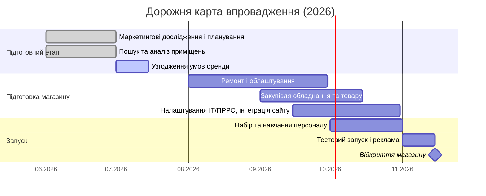

# Діаграма Ганта — відкриття фізичного магазину footballshop.com.ua (2026)

## Ключові віхи

| Етап | Період | Результат |
|:--|:--|:--|
| Маркетингові дослідження і планування | червень–липень 2026 | Підтверджена концепція, ЦА, асортимент |
| Пошук та аналіз приміщень | червень–липень 2026 | Шорт-ліст локацій (40–50 м²) |
| Узгодження умов оренди | липень 2026 | Підписаний договір оренди |
| Ремонт і облаштування | серпень–вересень 2026 | Готовий торговий зал, стелажі, фасад |
| Закупівля обладнання та товару | вересень–жовтень 2026 | Початковий товарний запас, каса, техніка |
| Налаштування ІТ/ПРРО, інтеграція сайту | вересень–жовтень 2026 | Єдиний облік залишків онлайн/офлайн, ПРРО |
| Набір та навчання персоналу | жовтень 2026 | 2 навчені співробітники |
| Тестовий запуск і реклама | перша половина листопада 2026 | Відпрацьовані процеси, прогрітий трафік |
| **Офіційне відкриття магазину** | **15 листопада 2026** | **Старт продажів** |

> Діаграму можна переглянути у будь-якому редакторі з підтримкою Mermaid
> (GitHub, GitLab, VS Code з плагіном Mermaid, або на https://mermaid.live).
