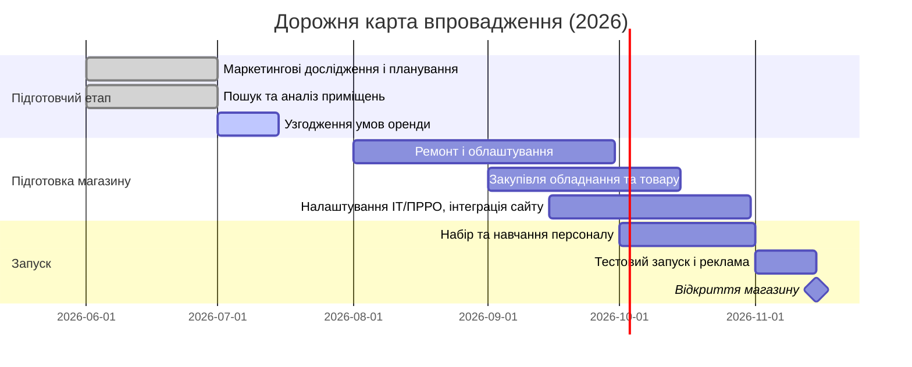

# Виконавчий звіт: footballshop.com.ua — конкурентний аналіз і модель залучення інвестора

> **Статус документа:** доопрацьована та фактично перевірена редакція (станом на червень 2026).
> **Методологічна примітка про достовірність даних.** Частина показників у звіті —
> оцінкові (частки ринку, обсяги трафіку, окремі ціни). Вони ґрунтуються на
> публічних джерелах та експертних припущеннях і позначені як «оцінка». Точні
> цифри потребують підтвердження через платні SEO-сервіси (Ahrefs/Semrush),
> офіційну звітність конкурентів та польове дослідження цін. Назви брендів і
> конкретні ціни слід перевіряти безпосередньо на сайтах перед використанням у
> переговорах із інвестором.

## 1. Профіль footballshop.com.ua

**Асортимент та ціни.** Інтернет-магазин *footballshop.com.ua* пропонує широкий
асортимент футбольних товарів: футбольну форму (командні комплекти, шорти, гетри,
манішки тощо), взуття (бутси, сороконіжки, футзалки), м'ячі, аксесуари (щитки,
сумки, фляги тощо), а також продукцію інших видів спорту (баскетбол, волейбол).
Товари переважно брендові (Nike, Adidas, Puma та ін.) середнього цінового рівня.
На сайті є категорії «Новинки», «Рекомендовані», а також відділ **«Фан-зона»** з
футбольною атрибутикою (сувеніри, шарфи, постери тощо).

> Конкретні моделі та ціни (наприклад, м'ячі SELECT, бутси Nike Mercurial)
> потрібно звірити з актуальним каталогом — асортимент і ціни змінюються, тому в
> цій редакції точкові цифри подано як ілюстративні, а не підтверджені.

**Розміщення та трафік.** Відомий контакт: телефон +380 (68) 797-46-46, місто Київ
(фізична адреса у відкритих джерелах не вказана). За даними відкритих
SEO-інструментів, сайт не входить до топ-50 українських ресурсів у спортивній
категорії; значна частина трафіку — пошук за брендовими запитами. Відкритих метрик
мало, тож оцінки трафіку наближені.

**Сильні сторони:**
- Вузька нішева спеціалізація на футбольній тематиці з широким асортиментом.
- Фокус на командну екіпіровку та фан-товари («Фан-зона»).
- Можливості оптових закупівель м'ячів і нанесення принтів (DTF-друк).

**Слабкі сторони:**
- Нижча впізнаваність порівняно з мережевими гравцями; обмежений маркетинговий бюджет.
- Відсутність фізичної присутності (поки лише онлайн).
- Залежність від імпорту (валютний курс і логістика воєнного часу впливають на ціни).

**SEO та мовні версії.** Сайт має україномовну версію (для ринку України це базова
вимога). Наявність російськомовної версії — спірне рішення для 2026 року: воно може
давати додатковий органічний трафік, але потенційно шкодить позиціонуванню бренду
та індексації україномовних запитів. Рекомендація: пріоритезувати україномовний
контент і метадані; доцільність російської версії оцінити окремо за реальною
аналітикою. Конкретні позиції за ключовими словами слід моніторити через
Semrush/Ahrefs.

## 2. Конкурентне середовище

Проаналізовано основних українських онлайн-конкурентів у футбольній тематиці.
Частки ринку нижче — **оцінкові** (немає відкритої офіційної звітності).

- **Soccer-Shop (soccer-shop.com.ua)** — великий «супермаркет» спорттоварів з
  акцентом на футбол: форми, взуття, м'ячі, воротарська екіпіровка, аксесуари, а
  також товари для інших видів спорту. Активно пропонує командне екіпірування і
  виготовлення форм. УТП: фанатська атрибутика та офлайн-шоуруми. Маркетингові
  меседжі сайту («№1 в Україні», знижки до 60%) — рекламні твердження, а не
  верифіковані факти.
- **Football World (football-world.com.ua)** — мультиспортивний магазин із великою
  футбольною секцією, суддівською формою, подарунковими сертифікатами. УТП: широкий
  вибір брендів під одним дахом, доставка по Україні.
- **Rabona (rabona.com.ua)** — футбольний магазин із офлайн-точками у кількох містах,
  активний у соцмережах. Акцент на взутті та екіпіруванні топових брендів (Nike,
  Adidas, Puma, Joma). УТП: фізичні магазини, атмосфера покупок.
  *(Примітка: бренд «MerrRun» зі вхідного матеріалу не вдалося підтвердити —
  ймовірно помилка; зі списку видалено до перевірки.)*
- **Атрибутика (atributika.com.ua)** — спорттовари з офлайн-точками у Києві.
  Спеціалізація: футбольна форма (зокрема клубна з емблемами), взуття, аксесуари,
  відділ «Друк на товарі». УТП: офлайн-магазини з примірочними, нанесення номерів.
- **Футбольна Точка (soccerpoint.com.ua)** — нішевий інтернет-магазин футбольної
  екіпіровки (взуття, форма, м'ячі, воротарське спорядження). УТП: індивідуальний
  підхід, докладні описи товарів, гнучке ціноутворення.
- **Football Mall (footballmall.com.ua)** — за даними пошуку, бюджетний сегмент;
  ресурс маловідомий, працює обмежено (потребує перевірки актуальності).
- **Інші гравці:** GOLEADOR, FanShop, **Sportano.ua** (європейська мультиспортивна
  платформа) — не є прямими нішевими конкурентами, але відтягують частину попиту
  ціною та брендом.

**Порівняльна таблиця (оцінкові дані):**

| Магазин | URL | Асортимент | Ціновий сегмент | Унікальна пропозиція | Оцінка позиції |
|:--|:--|:--|:--|:--|:--|
| Soccer-Shop | soccer-shop.com.ua | Форма, взуття, м'ячі, аксесуари, командне екіпірування | Середній/високий | Офлайн-шоуруми; пошиття форми; фан-атрибутика | Один із лідерів ніші *(оцінка)* |
| Football World | football-world.com.ua | Футбол + інші види спорту, суддівська форма | Середній | Мультиспорт, широка лінійка брендів | Середній гравець *(оцінка)* |
| Rabona | rabona.com.ua | Футбольне взуття, м'ячі, екіпіровка, спортодяг | Середній | Регіональні офлайн-магазини, сильний SMM | Середній гравець *(оцінка)* |
| Атрибутика | atributika.com.ua | Форма, взуття, клубна атрибутика, друк | Середній/високий | Офлайн-магазини у Києві, нанесення логотипів | Нішевий, офлайн-фокус *(оцінка)* |
| SoccerPoint | soccerpoint.com.ua | Форма, взуття, м'ячі, воротарське спорядження | Економ/середній | Онлайн-фокус, гнучкі ціни | Невеликі обсяги *(оцінка)* |
| Football Mall | footballmall.com.ua | Футбол, бюджетний сегмент | Низький | Низькі ціни | Маловідомий, потребує перевірки |
| Sportano.ua | sportano.ua | Мультиспорт | Середній/високий | Дистриб'юція 600+ брендів, імпорт із ЄС | Непрямий конкурент |

## 3. Операційний план

> **КРИТИЧНА ПРАВКА.** Вхідний матеріал рекомендував **1С-Бітрікс**,
> **1С:Підприємство** та **МойСклад**. Станом на **6 січня 2026 року**
> Держспецзв'язку офіційно **заборонила** використання російського ПЗ родини **1С**
> та **BAS** в Україні; заборона стосується не лише закупівель, а й самого факту
> використання, зі штрафами до **2% річного обороту**. Bitrix (1С-Бітрікс,
> Bitrix24) та МойСклад також є продуктами російського походження. **Ці системи
> використовувати не можна.** Нижче наведено допустимі альтернативи.

- **Облік запасів та ERP/CRM (дозволені рішення).** Українські та нейтральні
  системи: **Dilovod**, **MASTER:Бухгалтерія**, **IT-Enterprise**, **SmartFusion**,
  а також open-source/міжнародні **Odoo**, **ERPNext**. Для роздрібу та
  e-commerce — українські CRM/обліки **KeyCRM**, **SalesDrive**, **Perfectum**.
  Потрібна синхронізація залишків між складом і магазином через API, звіти про
  залишки, точки дозамовлення (reorder point), штрихкодування та мобільні сканери.
- **Логістика/комплектація.** Доставка по Україні через Нову пошту, Укрпошту,
  Justin (найпоширеніша — Нова пошта). Можливий самовивіз із нового магазину. У
  собівартість закласти тарифи доставки та пакувальні матеріали.
- **POS-інтеграція та омніканальність.** Єдина база товарів і залишків для онлайну
  й офлайну, спільний каталог, єдиний акаунт клієнта (історія замовлень, бонуси).
  Програмні РРО — **Checkbox** (український ПРРО), **Вчасно.Каса**, або POS-системи
  для роздробу **Poster**, **iKassa**. Фіскалізація обов'язкова (формування
  Z-звіту). ПРРО для більшості розрахункових операцій є обов'язковими в Україні з
  2022 року.
- **CMS та платіжна інфраструктура.** Допустимі платформи: **WooCommerce**,
  **Shopify**, **OpenCart**, **Magento**, або кастомне рішення (поточний сайт —
  на Next.js). Підключення українських платіжних шлюзів (LiqPay, Fondy, Portmone,
  WayForPay) та інтеграція з Новою поштою. 1С-Бітрікс як CMS — **виключити** (див.
  правку вище).
- **Поточні витрати.** Утримання складу (оренда, зберігання), зарплати
  комплектувальників/операторів, комунальні, інтернет. Оптимізація через крос-промо
  онлайн/офлайн і єдину бонусну програму.

## 4. Юридичні та фінансові схеми з інвестором

Мета — залучити інвестора у фізичну точку **без передачі частки в онлайн-бізнесі**.
Можливі конструкції:

- **Окрема юридична особа (нове ТОВ / SPV).** Фізична точка оформлюється на окреме
  ТОВ; інвестор входить капіталом або позикою саме в цю компанію. Онлайн-магазин,
  права на сайт і торгову марку залишаються в іншій (материнській) структурі та
  100% під контролем власника.
- **Позика / конвертована позика (convertible loan).** Інвестор надає кредит під
  фіксований відсоток; за домовленістю частина боргу може конвертуватися в частку
  **нового ТОВ**. Перевага — контроль (власник може не конвертувати) і фіксований
  дохід інвестора; мінус — зобов'язання з виплат і ризик неповернення.
- **Договір про спільну діяльність (просте товариство, гл. 77 ЦКУ).** Інвестор
  фінансує лише офлайн-проєкт і отримує частину чистого прибутку точки без зміни
  структури власності ТОВ. Плюс — гнучкість; мінус — слабший захист інвестицій,
  відсутність корпоративних прав, податкові нюанси.
- **Франчайзинг / ліцензія на бренд (договір комерційної концесії, гл. 76 ЦКУ).**
  Інвестор відкриває точку під брендом і платить роялті/відсоток, не отримуючи прав
  на онлайн-бізнес. Плюс — чисто контрактна структура; мінус — потреба формалізувати
  стандарти, навчання й аудит.
- **Управлінський контракт (management contract).** Власник зберігає управління,
  інвестор фінансує та отримує винагороду/представництво у фінансовому контролі
  нового ТОВ без частки в материнській компанії; із KPI та умовами виходу.

**Орієнтовні пункти term-sheet:**
- *Предмет:* інвестор надає фінансування у розмірі X грн виключно на запуск точки
  (оренда, ремонт, обладнання, товар).
- *Транші:* напр., 20% одразу, решта — за досягненням віх (підписання оренди,
  дозволи тощо).
- *Розподіл доходу:* фіксований % від чистого прибутку (позикова схема) або частка
  виручки (revenue-share).
- *Конвертація:* право конвертувати позику в частку нового ТОВ через 2–3 роки за
  узгодженою оцінкою.
- *Гарантії:* застава (обладнання, орендні права), фінзвітність, право аудиту.
- *Вихід:* умови розірвання та викупу частки.

**Податкові та регуляторні аспекти (станом на 2026, перевірено):**
- **ПРРО/РРО:** магазин зобов'язаний застосовувати програмний РРО (напр.,
  Checkbox) при розрахунках із покупцями.
- **Оподаткування дивідендів інвестору-фізособі:** **ПДФО 5%** (якщо ТОВ на
  загальній системі) або **9%** (якщо емітент на єдиному податку), плюс **військовий
  збір 5%**. Військовий збір з дивідендів утримують лише тоді, коли вони
  оподатковуються ПДФО. *(Виправлено: попередня цифра «18–23%» була некоректною;
  чинна ставка військового збору для фізосіб — 5%.)*
- **Процентний дохід інвестора за позикою:** оподатковується ПДФО 18% + військовий
  збір 5%.
- **Розмежування бізнесів:** онлайн і офлайн доцільно вести через окремі
  ФОП/ТОВ, щоб прибуток і ризики не змішувалися.
- **Законодавство:** Закон «Про товариства з обмеженою відповідальністю» дозволяє
  конвертацію боргу в капітал ТОВ. Якщо інвестор — нерезидент, врахувати валютне
  регулювання НБУ.

> Податкові ставки та схеми слід підтвердити з податковим консультантом перед
> підписанням — норми воєнного часу змінюються.

## 5. Фінансова модель

Орієнтовні оцінки для магазину ~40–50 м² (нижня шкала витрат). Усі суми —
прогнозні й потребують уточнення під конкретну локацію та орендні ставки.

| Стаття | Сума (грн) |
|:--|--:|
| **CapEx** | |
| Ремонт/облаштування | ~200 000 |
| Початковий товарний запас | ~300 000 |
| Обладнання / каса | ~50 000 |
| Маркетинг запуску | ~30 000 |
| **Разом CapEx** | **~580 000** |
| **OpEx (на місяць)** | |
| Оренда | 25 000 |
| Зарплати (2 співробітники + податки) | 60 000 |
| Комунальні + інтернет | 7 000 |
| Маркетинг/промо | 10 000 |
| Інші витрати | 8 000 |
| **Разом OpEx** | **~110 000/міс.** |
| **Потрібна виручка** (за націнки ~40%) | **~275 000/міс.** |

> Примітка щодо логіки беззбитковості: щоб валова маржа (~40% від виручки)
> покривала ~110 000 грн OpEx, виручка має бути ~275 000 грн/міс. Це спрощена
> модель — реальна точка беззбитковості залежить від структури націнки за
> категоріями, знижок і сезонності.

**Сценарії повернення інвестицій (ілюстративні):**
- *Позикове фінансування:* позика ~600 000 грн під ~12% річних, погашення за
  графіком 3–5 років; інвестор отримує фіксований відсотковий дохід. Темп
  повернення залежить від фактичного прибутку точки.
- *Частка від прибутку (revenue/profit-share):* напр., 30% чистого прибутку. За
  річного прибутку ~240 000 грн інвестор отримує ~72 000 грн/рік; орієнтовний строк
  повернення вкладу — кілька років (без урахування зростання).
- *Конвертація:* якщо позика конвертується у 20–30% частки нового ТОВ при досягненні
  цільового EBIT, ROI залежить від оцінки бізнесу на момент конвертації.

Детальну фінмодель (CapEx/OpEx, прогноз продажів, сценарії окупності) доцільно
вивести в окремий XLSX із параметрами для сценарного аналізу.

## 6. Дорожня карта

**Ключові віхи:** підбір приміщення (червень–липень) → ремонт (серпень–вересень) →
постачання й інтеграції (вересень–жовтень) → тестовий запуск і навчання (жовтень) →
офіційне відкриття (листопад 2026). Паралельно в першому півріччі — договори з
постачальниками та маркетинговий план.

## 7. Ризики та мінімізація

**Ризики:**
- *Ринкові:* висока конкуренція, зміна попиту, тиск маркетплейсів.
- *Операційні:* дефіцит або затоварення складу, неточний прогноз попиту, брак
  кваліфікованих продавців.
- *Фінансові:* валютні коливання (імпорт), зростання оренди/зарплат, касові
  розриви на старті, сезонність.
- *Юридичні/регуляторні:* зміни податкового законодавства воєнного часу;
  **ризик використання забороненого ПЗ** (1С/BAS) — уникати на рівні вибору
  систем; ризик конфлікту з інвестором щодо контролю над онлайн-бізнесом.

**Мінімізація:**
- Глибокий аналіз попиту (аналітика, опитування ЦА) для точних прогнозів.
- Регулярний моніторинг конкурентів (ціни, акції, новинки).
- Диверсифікація постачальників; контроль рівнів запасу через дозволену ERP/CRM.
- Чіткі механізми вирішення спорів у договорі з інвестором (арбітражні
  застереження, дія договору за форс-мажору).
- Фінансова «подушка» та комерційне страхування (пожежа, форс-мажор).
- Прозора звітність перед інвестором і гнучкий графік виплат.

**Висновок.** Запуск офлайн-точки поряд із онлайн-магазином є доцільним за умови
правильної організації: ніша й онлайн-канал *footballshop.com.ua* доповнюються
перевагами фізичного магазину (примірка, миттєва покупка). Запропоновані юридичні
конструкції дозволяють залучити інвестиції без втрати контролю над онлайн-бізнесом.
Найважливіша операційна правка — повна відмова від забороненого російського ПЗ
(1С/Bitrix/BAS/МойСклад) на користь українських або нейтральних рішень.

---

### Перелік внесених правок (порівняно з вхідним матеріалом)
1. **Видалено рекомендації забороненого ПЗ** (1С-Бітрікс, 1С:Підприємство, МойСклад);
   додано дозволені альтернативи та попередження про заборону від 06.01.2026.
2. **Виправлено податкові дані:** військовий збір для фізосіб — 5% (а не 1.5% чи
   «18–23%»); уточнено оподаткування дивідендів і процентного доходу.
3. **Позначено оцінкові показники** (частки ринку, трафік, ціни) як неперевірені,
   додано методологічну примітку.
4. **Видалено непідтверджений бренд «MerrRun»** до перевірки.
5. **Мовна редактура:** усунено росіянізми та сленг («остатків»→«залишків»,
   «оговори»→«застереження», «двіжуха», «нераспродані» тощо).
6. **Виправлено діаграму Gantt** (коректний `dateFormat`, віха відкриття) і
   замінено помилковий заголовок «Міленіумі» на «Ключові віхи».
7. **Пом'якшено рекламні твердження конкурентів** («№1 в Україні», «знижки 60%») —
   позначено як маркетингові меседжі, а не факти.

**Джерела перевірки ключових правок:**
- Військовий збір і оподаткування дивідендів 2026 — [tax.gov.ua](https://tax.gov.ua/deklaratsiyna-kampaniya-2026/stavki-podatku-na-dohodi-fizichnih-osib-ta-viyskovogo-zboru), [Oschadbank](https://www.oschadbank.ua/blog/vijskovij-zbir-2026-cinni-stavki-dedlajni-ta-perelik-pilg).
- Заборона 1С/BAS в Україні — [Держспецзв'язку (cip.gov.ua)](https://cip.gov.ua/ua/statics/perelik-zaboronenogo-do-vikoristannya-programnogo-zabezpechennya-ta-komunikaciinogo-merezhevogo-obladnannya), [DOU](https://dou.ua/lenta/news/1c-in-list-of-prohibited-software/), [AIN](https://ain.ua/2026/01/14/v-ukrayini-zaboronili-rosiiskii-soft-1s/).
